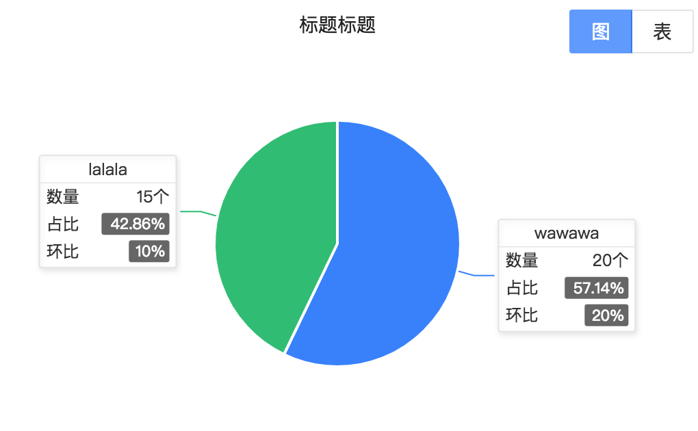
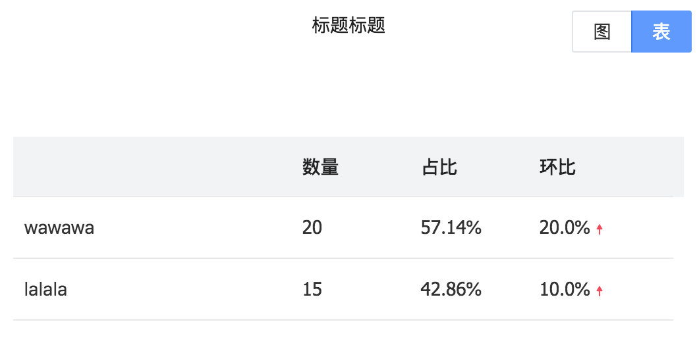
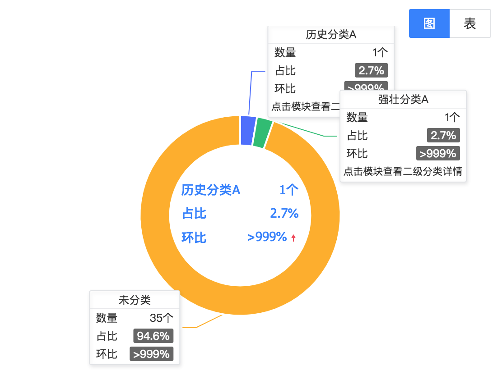
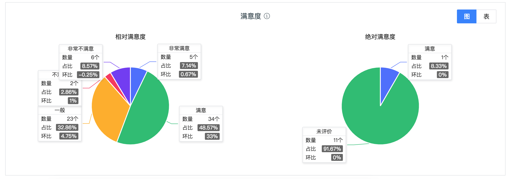

# PieChart.js
呼叫重构里新样式的饼图（之后会陆续同步到工作报表等其它地方），可配合新的饼图option生成方法initPieOption_new使用，可开启图表切换（表格数据从option的series.data里读取。也可以自己写表格），如图：  



使用示例：
```jsx
<PieChart
  showTable
  height={300}
  option={initPieOption_new({
    series: {
      data: [{
        name: 'lalala',
        value: 15,
        chain: .1 // 环比。不传就不显示环比
      }, {
        name: 'wawawa',
        value: 20,
        chain: .2 // 环比
      }],
    },
  })}
  title="标题标题"
/>
```

# DoughnutChart.js
环形图，配合initDoughnutOption使用，可开启图表切换（表格数据从option的series.data里读取。也可以自己写表格），如图：  


使用示例：
```jsx
<DoughnutChart
  showTable
  height={420}
  option={initDoughnutOption({
    series: {
      radius: ['37%', '53%'],
      data: someData.map(({name, value, preValue}, index) => {
        return {
          name,
          value,
          chain: (value - preValue) / preValue,
          itemStyle: {
            color: ECHART_SERIES_COLORS[index],
          },
        };
      }),
    },
  })}
/>
```

# ChartBox.js
承载图表的框框，带边框，中间可选展示标题，右侧可选展示图表切换按钮，如图：  


注意，ChartBox只是一个简单的框框，这里的图表切换只是单纯的按钮（切换时会触发onSwitch事件），并不像上面的PieChart或DoughnutChart组件会自动帮你生成表格，你需要自己处理ChartBox中展示什么。

使用示例:
```jsx
<ChartBox
  title={<HeadConditionTitle title="标题提踢" tips={TIP_LALALA}/>}
  onSwitch={this.handleSwitch}
>
  {/* 这里放一些图或表 */}
</ChartBox>
```