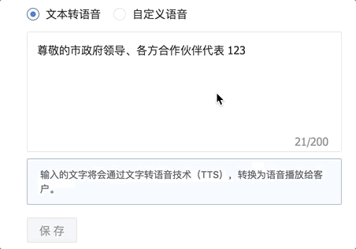

 基于ppfish的Button组件，共四种状态：
 * normal：正常状态
 * loading：加载状态，文字左侧会显示加载动画
 * success：加载/操作成功时的状态，文字左侧显示√。（需在外部控制数秒后回到normal状态）
 * error：加载/操作失败时的状态，文字右侧侧显示×。（同上）

其它属性与ppfish一致，比如你可以控制它是否disabled。
 
 效果见下图：  

